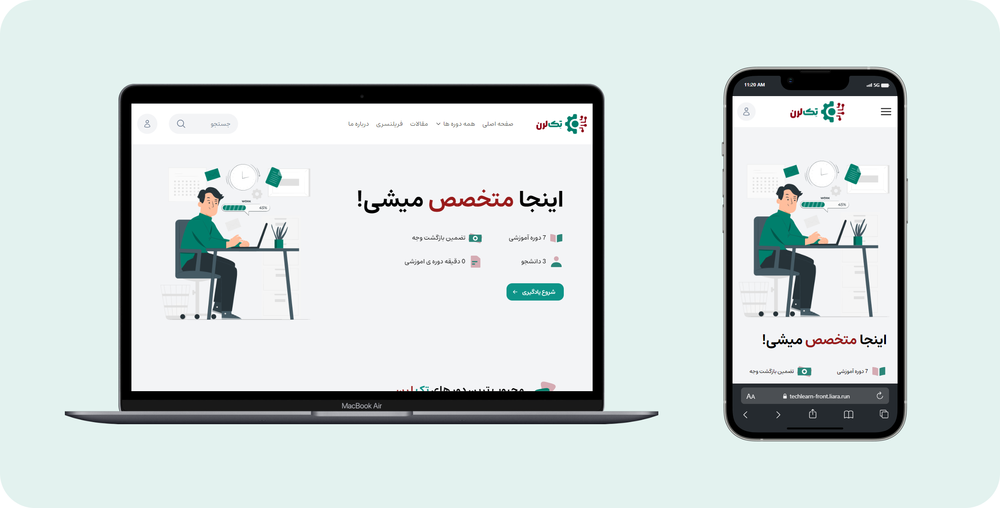

# • techLearn 🚀
This is a web application responsive project has been developed with Html && Css && pure JavaScript and some useful libraries.

<h2>• General info </h2>

Welcome to my project!

Feel free to customize it to better fit your project and its features. Good luck! 🚀

<h2>• Technologies ⚙️ </h2>

Project is created with:

✨ HTML   

✨ JS

✨ TailwindCss 

✨ SweetAlert2

✨ Swiper

<h2>• Features 💡 </h2>

* User/Admin Registration and Login
* Adding Courses
* Adding Sessions to a Course
* Adding Blog Posts
* Adding/Edit/Remove/Ban User From Admin Panel
* Creating Menu Items and Submenus
* Creating Category
* Comment Submission, Pending Approval by Admin
* Admin Response to Comments
* Adding Discount Codes for a Course
* Sending Messages to Admin via Contact Form
* Admin Response to User Message With Email
* Edit User Profile
* Show Buyed Courses In User Panel
* Register In Courses

## • Project Demo 🎥

## • Live Demo🤘
Here is a working live demo :  [techLearn](https://techlearn-front.liara.run/public/)
